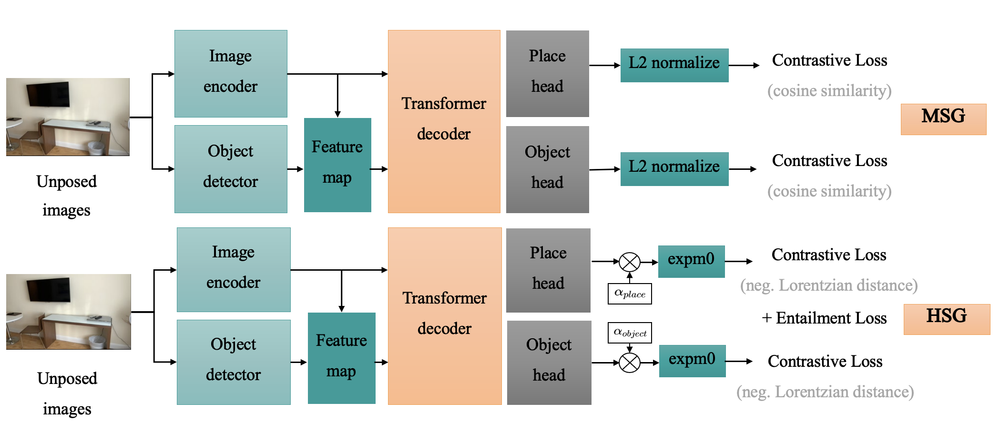

# HSG: Hyperbolic Scene Graph
This is the official repository for the paper:
> **HSG: Hyperbolic Scene Graph**
>
> [Liyang Wang](https://github.com/lw1120)\*, [Zeyu Zhang](https://steve-zeyu-zhang.github.io/)\*<sup>†</sup>, and [Hao Tang](https://ha0tang.github.io/)<sup>#</sup>
>
> \*Equal contribution. <sup>†</sup>Project lead. <sup>#</sup>Corresponding author.


## ✏️ Citation
If you find our code or paper helpful, please consider starring ⭐ us and citing:
```bibtex
@article{wang2026hsg,
  title={HSG: Hyperbolic Scene Graph},
  author={Wang, Liyang and Zhang, Zeyu and Tang, Hao},
  journal={European Conference on Computer Vision},
  year={2026},
  note={Under Review}
}
```
---

## 🏃 Intro HSG
HSG is a **hyperbolic representation learning framework** that models scene graphs in non-Euclidean space to better capture hierarchical relationships for structured 3D scene understanding.

Scene graph representations enable structured visual understanding by modeling objects and their relationships, and have been widely used for multiview and 3D scene reasoning. Existing methods such as MSG learn scene graph embeddings in Euclidean space using contrastive learning and attention-based association. However, Euclidean geometry does not explicitly capture hierarchical entailment relationships between places and objects, limiting the structural consistency of learned representations. To address this, we propose Hyperbolic Scene Graph (HSG), which learns scene graph embeddings in hyperbolic space where hierarchical relationships are naturally encoded through geometric distance. Our results show that HSG improves hierarchical structure quality while maintaining strong retrieval performance. The largest gains are observed in graph-level metrics: HSG achieves a PP IoU of **33.17** and the highest Graph IoU of **33.51**, outperforming the best AoMSG variant (25.37) by **8.14**, highlighting the effectiveness of hyperbolic representation learning for scene graph modeling.



## Implementations
### Requirements

First, setup the environment by running
```shell
git clone https://github.com/AIGeeksGroup/HSG.git
cd hsg
conda create --name hsg python=3.11.8
conda activate hsg
pip install -r requirements.txt
```
This `requirements.txt` contains minimum dependencies estimated by running `pipreqs`.

*Alternatively*, to fully replicate the environment you can also run:
```shell
git clone [https://github.com/AIGeeksGroup/HSG/MSG]().git
cd hsg
conda env create -f environment.yml
conda activate hsg
```
### Data and weights

HSG data is converted from Apple's [ARKitScenes](https://github.com/apple/ARKitScenes) by transforming its 3D annotations to 2D.
The converted dataset can be found at this [Dataset Hub](https://huggingface.co/datasets/ai4ce/MSG) on Huggingface.
We have also kept the code snippets for data convertion in `data_preprocess`.

To use the data, download and unzip the data to `./data/hsg`
- [ ] TODO: specify the data usage. 

```shell
mkdir -p data/hsg
```

### Inference

To do inference with the pretrained weights, run:

```shell
python inference.py --experiment inference
```
which loads configurations from the file `./configs/experiments/inference.yaml`, where the dataset path and the evaluation checkpoint are specified.
You can also specify them via arguments which will overwrite the YAML configs. For example:
```shell
python inference.py --experiment inference \
--dataset_path PATH/TO/DATASET \
--eval_output_dir PATH/TO/MODEL/CHECKPOINT \
--eval_chkpt CHECKPOINT/FILE
```

Additional to inference, you can also leverage MSG for topological localization. Please see `localization.py` for details.

### Training

To train the AoMSG model for MSG:
```shell
python train.py --experiment aomsg
```

To train the SepMSG baselines:
```shell
python train.py --experiment sepmsg
```
Please refer to the respective configuration files `./configs/experiments/aomsg.yaml` and `./configs/experiments/sepmsg.yaml` for the detailed settings.

To resume training of a pretrained checkpoint, set `resume=True` and specify the `resume_path` to the checkpoint in the corresponding YAML configuration files.


For evaluation, simply change the script while keep the same `experiment` configuration, in which `eval_output_dir` and `eval_chkpt` are specified.
```shell
# evaluate AoMSG
python eval.py --experiment aomsg 
# evaluate SepSMG
python eval.py --experiment sepmsg 
# evaluate SepMSG-direct, which directly use features from froze backbone for MSG
python eval.py --experiment direct 
```

> **NOTE:**
> 
> This release focuses on the implementation of MSG. Object detection dependency is not included. 
> To use detection results instead of groundtruth detection, we can specify detection results in files and give the `result_path` as is illustrated in `./configs/experiments/aomsg_gdino.yaml` where detection results obtained from [GroundingDINO](https://github.com/IDEA-Research/GroundingDINO) is used.
> 
> This means you need to run detection separately and save the results to a path. In the data hub we provide the gdino results for convenience. In the future release, we may include a version incorporating online detection.

## 🌟 Star History

[](https://www.star-history.com/#AIGeeksGroup/HSG&Date)


## 😘 Acknowledgement
We thank the authors of [MSG](https://github.com/ai4ce/MSG), [MERU](https://github.com/facebookresearch/meru) for their open-source code.
